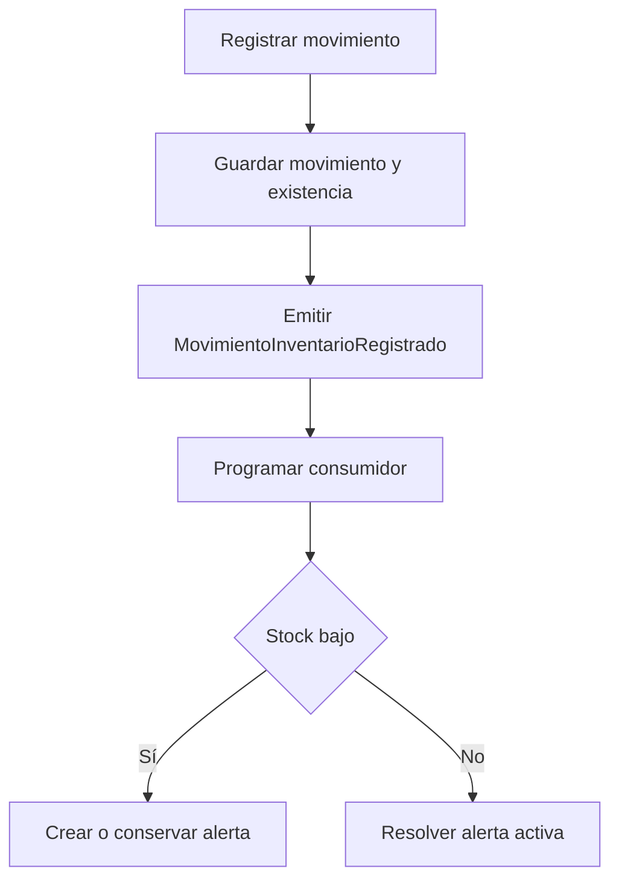
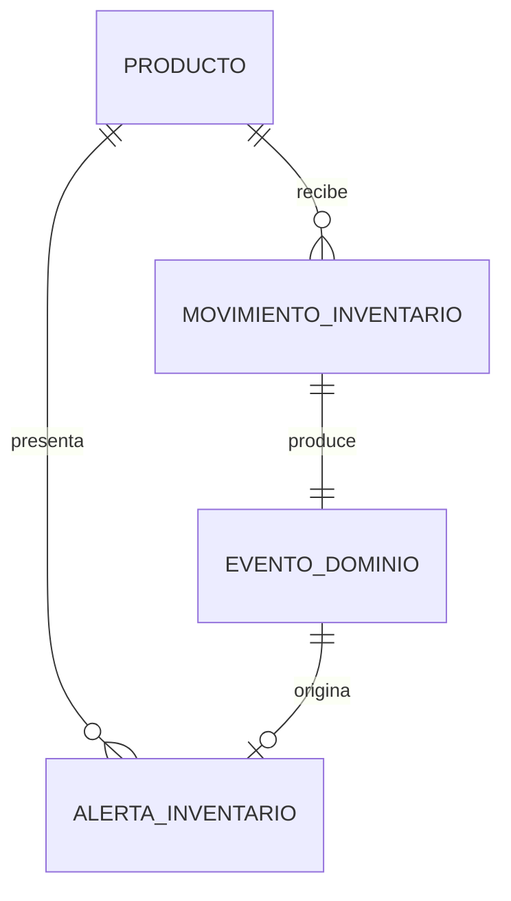

# Architecture: Sistema de Gestión de Inventario

> **ID:** ARCH-inventario
> **Versión:** 1
> **Fecha:** 2026-08-03
> **Autor:** Angel Yahir Murillo Gallegos
> **Vision padre:** V-inventario

---

## 1. Stack

Esta arquitectura describe cómo se propone construir la primera versión del sistema. Las tecnologías, estructuras y patrones todavía deberán aplicarse y validarse durante el desarrollo.

El alcance se limita a un sistema demostrativo de un solo almacén, sin autenticación, con alertas internas y un flujo EDA formado por un productor, un evento y un consumidor.

| Capa | Tecnología | Por qué (para este producto) |
|---|---|---|
| Aplicación web | Next.js con App Router | Permitirá organizar el panel, los productos, los movimientos y las alertas como rutas dentro de un solo proyecto. |
| Interfaz | React | Permitirá construir formularios y tablas que reaccionen a los cambios recibidos desde Convex. |
| Lenguaje | TypeScript en modo `strict` | Permitirá definir tipos cerrados para entradas, salidas, eventos y estados de alerta, reduciendo operaciones inválidas. |
| Componentes | Shadcn/ui | Proporcionará formularios, botones, tablas, diálogos y mensajes sin crear todos los componentes visuales desde cero. |
| Estilos | Tailwind CSS | Permitirá adaptar los componentes de Shadcn/ui y mantener una interfaz consistente. |
| Backend y base de datos | Convex | Permitirá guardar el movimiento, actualizar la existencia y emitir el evento dentro de una mutation, además de actualizar las consultas de la interfaz en tiempo real. |
| Procesamiento de eventos | Convex Scheduler e internal mutations | Permitirá programar y ejecutar el consumidor de `MovimientoInventarioRegistrado` sin instalar Kafka, RabbitMQ u otro broker. |
| Formularios | React Hook Form y Zod | Permitirá validar los datos antes de enviarlos y mostrar errores claros al usuario. Convex volverá a validar las reglas importantes. |
| Pruebas | Vitest y `convex-test` | Permitirá comprobar las reglas de inventario y el procesamiento del evento sin automatizar el navegador con Playwright. |
| Gestor de paquetes | pnpm | Mantendrá una instalación reproducible mediante `pnpm-lock.yaml`. |
| Repositorio | GitHub | Permitirá trabajar con branches, pull requests y Conventional Commits durante la capacitación. |
| Deploy | Vercel | Permitirá publicar la aplicación desde el repositorio y generar una versión de demostración. |

---

## 2. Decisiones de Arquitectura

Las siguientes decisiones representan la dirección propuesta. Se confirmarán conforme se implemente el sistema y podrán actualizarse si la solución final cambia.

### AD-1: Convex como backend completo

- **Contexto:** El proyecto necesita almacenar datos, validar movimientos, actualizar la interfaz y ejecutar un consumidor de eventos. Crear una API REST adicional aumentaría el trabajo disponible para una entrega de dos semanas.
- **Decisión:** Se utilizarán queries, mutations, internal mutations y scheduled functions de Convex. Next.js se encargará de la presentación y no tendrá una segunda implementación de la lógica de inventario.
- **Alternativas descartadas:** Route Handlers de Next.js con otra base de datos, porque sería necesario implementar manualmente la comunicación, las transacciones y las actualizaciones en tiempo real. Una API REST encima de Convex, porque duplicaría la capa de acceso.
- **Consecuencias:** Habrá menos configuración y una sola ubicación para las reglas de negocio. Como intercambio, el backend dependerá de las capacidades de Convex.

### AD-2: La existencia solo cambiará mediante movimientos

- **Contexto:** Si la existencia pudiera editarse directamente, el historial dejaría de explicar por qué aumentó o disminuyó el inventario.
- **Decisión:** `existenciaActual` se almacenará en `productos` como una proyección de lectura rápida. No existirá una mutation pública para asignarla directamente; únicamente cambiará al registrar una entrada o una salida.
- **Alternativas descartadas:** Permitir editar la existencia desde el formulario de producto, porque rompería la trazabilidad. Calcular la suma completa de movimientos en cada consulta, porque agregaría trabajo innecesario para mostrar el panel.
- **Consecuencias:** La lectura de la existencia será sencilla y cada modificación tendrá un movimiento relacionado. La mutation de movimientos deberá mantener sincronizados el historial y la proyección.

### AD-3: Alertas procesadas mediante EDA

- **Contexto:** El proyecto de capacitación debe demostrar Event-Driven Architecture, pero solo dispone de dos semanas y será desarrollado por una persona.
- **Decisión:** `movimientosInventario.registrar` funcionará como productor. Guardará el evento `MovimientoInventarioRegistrado` y programará el consumidor `eventos.procesarMovimientoInventarioRegistrado`. El consumidor creará o resolverá una alerta de stock bajo.
- **Alternativas descartadas:** Crear la alerta directamente dentro de la mutation de movimientos, porque no demostraría separación entre productor y consumidor. Convertir todas las operaciones del sistema en eventos, porque ampliaría el alcance sin ser necesario para comprobar EDA.
- **Consecuencias:** La existencia se actualizará inmediatamente y la alerta será eventualmente consistente. Durante unos instantes podría mostrarse la nueva existencia antes de aparecer la alerta.

El flujo propuesto será:



### AD-4: EDA interno sin broker externo

- **Contexto:** Kafka y RabbitMQ son útiles para comunicación entre varios servicios, pero esta versión tendrá una sola aplicación y un solo backend.
- **Decisión:** `eventosDominio` funcionará como registro de eventos y Convex Scheduler como mecanismo de despacho.
- **Alternativas descartadas:** Kafka, RabbitMQ o un servicio de colas externo, porque agregarían instalación, configuración y puntos de fallo. Eventos únicamente en memoria, porque no permitirían revisar si un evento quedó pendiente, procesado o fallido.
- **Consecuencias:** Se podrán demostrar productor, evento, consumidor e idempotencia sin infraestructura adicional. La solución no pretende resolver mensajería distribuida entre múltiples sistemas.

### AD-5: Un solo evento y un solo consumidor en la primera versión

- **Contexto:** Incluir diferentes eventos, consumidores, reintentos avanzados y notificaciones externas pondría en riesgo la entrega.
- **Decisión:** La primera versión tendrá únicamente `MovimientoInventarioRegistrado` y `procesarMovimientoInventarioRegistrado`. El evento usará los estados `pendiente`, `procesado` y `fallido`.
- **Alternativas descartadas:** Agregar eventos separados para entrada, salida, creación de producto y alerta, porque no son necesarios para validar el flujo principal. Implementar reintentos con espera incremental, porque aumentaría la lógica y las pruebas requeridas.
- **Consecuencias:** El ejemplo EDA será pequeño y explicable. Los reintentos automáticos y nuevos consumidores quedarán como evolución futura.

### AD-6: Primera versión sin autenticación

- **Contexto:** El objetivo principal es implementar productos, movimientos, existencias, eventos y alertas dentro del tiempo restante.
- **Decisión:** No se integrará Clerk ni se crearán usuarios o roles técnicos. “Administrador” y “encargado” serán perfiles funcionales utilizados para describir quién usaría el sistema.
- **Alternativas descartadas:** Clerk, porque requiere configuración y pruebas adicionales. Autenticación propia, porque implicaría más tiempo y mayor riesgo de seguridad.
- **Consecuencias:** La aplicación solo podrá utilizar datos ficticios y se considerará una demostración. Antes de utilizarla con inventario real se deberá incorporar autenticación y autorización.

### AD-7: Pruebas reducidas a la lógica principal

- **Contexto:** El proyecto ya se encuentra en su segunda semana.
- **Decisión:** Se utilizarán Vitest y `convex-test` para validar movimientos, existencia, evento e idempotencia del consumidor. Los recorridos de interfaz se probarán manualmente.
- **Alternativas descartadas:** Playwright, porque configurar y mantener pruebas completas de navegador consumiría tiempo que debe dedicarse al flujo principal.
- **Consecuencias:** Las reglas críticas tendrán pruebas automáticas, pero la integración visual completa dependerá de una revisión manual antes de la entrega.

---

## 3. Patrones y Convenciones

Los patrones de esta sección son propuestas para orientar la implementación. Los fragmentos de código muestran la forma que deberán seguir las funciones y componentes; no indican que ya existan en el repositorio.

### 3.1 Estructura de proyecto

```text
sistema-inventario/
├── src/
│   ├── app/
│   │   ├── layout.tsx                    # Layout raíz y proveedor de Convex
│   │   ├── page.tsx                      # Panel principal
│   │   ├── productos/
│   │   │   ├── page.tsx                  # Catálogo de productos
│   │   │   └── [productoId]/page.tsx     # Detalle e historial del producto
│   │   ├── movimientos/
│   │   │   ├── page.tsx                  # Historial de movimientos
│   │   │   └── nuevo/page.tsx            # Registro de entrada o salida
│   │   └── alertas/page.tsx              # Alertas activas y resueltas
│   ├── componentes/
│   │   ├── ui/                            # Componentes de Shadcn/ui
│   │   ├── productos/                     # Formularios y tablas de productos
│   │   ├── movimientos/                   # Formulario e historial
│   │   ├── alertas/                       # Lista e indicador de stock bajo
│   │   ├── panel/                         # Tarjetas de resumen
│   │   └── proveedores/                   # Configuración de Convex para React
│   └── lib/
│       ├── esquemas/                      # Validaciones Zod de formularios
│       └── utilidades.ts                  # Funciones auxiliares de interfaz
├── convex/
│   ├── schema.ts                          # Tablas e índices
│   ├── productos.ts                       # Queries y mutations de productos
│   ├── movimientosInventario.ts           # Registro e historial de movimientos
│   ├── eventos.ts                         # Productor, consumidor y estado de eventos
│   └── alertasInventario.ts               # Consultas de alertas
├── docs/
│   ├── 01-vision-inventario.md
│   └── 02-architecture-inventario.md
├── CLAUDE.md
├── package.json
└── pnpm-lock.yaml
```

Esta estructura se creará progresivamente. Si durante la implementación una carpeta no resulta necesaria, podrá omitirse y la arquitectura deberá actualizarse al finalizar.

#### Páginas propuestas

| Ruta | Componente de página | Responsabilidad |
|---|---|---|
| `/` | `PaginaPanelInventario` | Mostrar existencias, movimientos recientes y alertas activas. |
| `/productos` | `PaginaProductos` | Mostrar y registrar productos. |
| `/productos/[productoId]` | `PaginaDetalleProducto` | Mostrar información e historial de un producto. |
| `/movimientos` | `PaginaMovimientos` | Mostrar entradas y salidas. |
| `/movimientos/nuevo` | `PaginaNuevoMovimiento` | Registrar una entrada o salida. |
| `/alertas` | `PaginaAlertas` | Mostrar alertas activas y resueltas. |

#### Componentes propuestos

| Componente | Responsabilidad |
|---|---|
| `FormularioProducto` | Capturar la información de un producto. |
| `TablaProductos` | Mostrar productos y existencia actual. |
| `FormularioMovimiento` | Registrar una entrada o salida. |
| `TablaMovimientos` | Mostrar el historial inmutable. |
| `IndicadorStockBajo` | Señalar que un producto alcanzó el mínimo. |
| `ListaAlertas` | Mostrar alertas activas y resueltas. |
| `TarjetaResumen` | Mostrar información resumida en el panel. |

### 3.2 Naming conventions

| Elemento | Convención | Ejemplo |
|---|---|---|
| Archivos y carpetas de React | kebab-case | `formulario-movimiento.tsx` |
| Componentes React | PascalCase con named export | `export function FormularioMovimiento()` |
| Hooks | camelCase con prefijo `use` | `useFormularioMovimiento` |
| Variables y funciones | camelCase | `existenciaResultante` |
| Tipos e interfaces | PascalCase | `TipoMovimiento` |
| Constantes | UPPER_SNAKE_CASE | `ESTADO_EVENTO_PENDIENTE` |
| Tablas de Convex | camelCase plural | `movimientosInventario` |
| Funciones públicas de Convex | verbo en camelCase | `productos.listar` |
| Funciones internas de Convex | verbo descriptivo en camelCase | `eventos.procesarMovimientoInventarioRegistrado` |
| Índices de Convex | prefijo `por_` en snake_case | `por_producto_creado_en` |
| Eventos | PascalCase en pasado | `MovimientoInventarioRegistrado` |
| Códigos de error | UPPER_SNAKE_CASE | `STOCK_INSUFICIENTE` |
| Variables de entorno | UPPER_SNAKE_CASE | `NEXT_PUBLIC_CONVEX_URL` |
| Branches | tipo + slug | `feature/registrar-movimiento` |
| Commits | Conventional Commits en inglés | `feat(inventory): register movement` |
| Pruebas | nombre del módulo + `.test.ts(x)` | `movimientosInventario.test.ts` |

Se conservarán los nombres obligatorios de las herramientas, como `page.tsx`, `layout.tsx`, `schema.ts`, `query`, `mutation` e `internalMutation`.

### 3.3 Patrones de código

Los siguientes fragmentos son patrones canónicos propuestos. Los detalles internos se completarán cuando se implemente cada función.

#### Query de Convex

Las consultas deberán usar índices cuando filtren una colección y no tendrán efectos secundarios.

```typescript
export const listar = query({
  args: {},
  handler: async (ctx) => {
    return await ctx.db
      .query("productos")
      .withIndex("por_activo", (q) => q.eq("activo", true))
      .collect();
  },
});
```

#### Mutation de movimiento y producción del evento

La mutation seguirá la secuencia validar, guardar movimiento, actualizar existencia, guardar evento y programar consumidor.

```typescript
export const registrar = mutation({
  args: {
    productoId: v.id("productos"),
    tipo: v.union(v.literal("entrada"), v.literal("salida")),
    cantidad: v.number(),
    motivo: v.string(),
  },
  handler: async (ctx, args) => {
    // 1. Obtener producto y validar la operación.
    // 2. Insertar el movimiento.
    // 3. Actualizar existenciaActual.
    // 4. Insertar MovimientoInventarioRegistrado.
    // 5. Programar procesarMovimientoInventarioRegistrado.
  },
});
```

Los comentarios representan responsabilidades propuestas; no son una implementación terminada.

#### Consumidor idempotente

```typescript
export const procesarMovimientoInventarioRegistrado = internalMutation({
  args: { eventoId: v.id("eventosDominio") },
  handler: async (ctx, { eventoId }) => {
    const evento = await ctx.db.get(eventoId);

    if (!evento || evento.estado === "procesado") return;

    // Crear, conservar o resolver la alerta del producto.
    // Marcar el evento como procesado cuando termine correctamente.
  },
});
```

#### Componente React con query reactiva

```tsx
"use client";

export function TablaProductos() {
  const productos = useQuery(api.productos.listar);

  if (productos === undefined) return <Skeleton />;
  if (productos.length === 0) return <p>No hay productos registrados.</p>;

  return <Tabla datos={productos} />;
}
```

#### Pruebas del flujo EDA

Como mínimo se comprobará:

1. Una entrada aumenta la existencia.
2. Una salida disminuye la existencia.
3. Una salida sin stock suficiente no deja escrituras parciales.
4. Registrar un movimiento crea un evento pendiente.
5. Procesar el evento con stock bajo crea una alerta.
6. Procesar nuevamente el mismo evento no duplica la alerta.
7. Una entrada por encima del mínimo resuelve la alerta activa.

### 3.4 Manejo de errores

#### Convex

- Los argumentos públicos se validarán mediante los validadores `v`.
- Las reglas de negocio se comprobarán dentro de la mutation.
- Si una validación falla, Convex revertirá las escrituras de la mutation.
- Un evento que no pueda procesarse se marcará como `fallido`; los reintentos automáticos avanzados quedan fuera de la primera versión.

| Código | Situación | Mensaje para la interfaz |
|---|---|---|
| `PRODUCTO_NO_ENCONTRADO` | El producto no existe. | El producto no está disponible. |
| `PRODUCTO_INACTIVO` | Se intenta mover un producto inactivo. | No se pueden registrar movimientos para este producto. |
| `CANTIDAD_INVALIDA` | La cantidad no es un entero positivo. | Ingresa una cantidad mayor que cero. |
| `STOCK_INSUFICIENTE` | La salida supera la existencia. | No hay existencia suficiente. |

#### React

- Las mutations se ejecutarán con `try/catch`.
- Los errores conocidos se convertirán en mensajes comprensibles.
- Los formularios conservarán sus datos cuando una operación falle.
- Las operaciones correctas mostrarán una confirmación mediante `toast`.

#### Logging

- Los fallos del consumidor incluirán `eventoId`, `movimientoId` y `productoId`.
- No se registrarán variables de entorno ni datos innecesarios del formulario.
- La primera versión utilizará los logs de Convex y Vercel; no añadirá otra plataforma de observabilidad.

### 3.5 Seguridad y auth

La primera versión no tendrá autenticación ni autorización. Esta ausencia es una reducción deliberada del alcance y no un patrón recomendado para un sistema real.

Se aplicarán las siguientes reglas:

1. Solo se utilizarán datos ficticios.
2. Todas las reglas importantes se validarán en Convex, aunque el formulario también valide.
3. Las funciones que procesan eventos serán internas y no podrán llamarse directamente desde el navegador.
4. Los productos con movimientos se desactivarán en lugar de eliminarse.
5. No se expondrán errores internos completos al usuario.
6. Los secretos y variables de entorno no se incluirán en el repositorio.

Si el proyecto se utiliza posteriormente con inventario real, deberá agregarse autenticación, protección de rutas, autorización en cada función y registro del usuario que realizó cada movimiento.

---

## 4. Modelo de datos

El modelo representa las entidades principales y sus relaciones. Los campos exactos, validadores e índices se detallarán durante la implementación o en los documentos de especificación.



### Entidades principales

| Entidad | Información principal | Responsabilidad |
|---|---|---|
| `productos` | SKU, nombre, descripción, existencia actual, stock mínimo y estado | Representar los artículos controlados por el sistema. |
| `movimientosInventario` | Producto, tipo, cantidad, existencia anterior, existencia resultante, motivo y fecha | Conservar el historial inmutable de entradas y salidas. |
| `eventosDominio` | Tipo, movimiento, producto, existencia resultante, stock mínimo, estado y fechas | Registrar el evento que será procesado por el consumidor. |
| `alertasInventario` | Producto, evento de origen, estado, existencia, stock mínimo y fechas | Representar los episodios de stock bajo. |

El único tipo de evento inicial será `MovimientoInventarioRegistrado`. Sus estados serán `pendiente`, `procesado` y `fallido`.

### Reglas de integridad

1. El SKU será único.
2. `stockMinimo` será un entero mayor o igual a cero.
3. La cantidad de un movimiento será un entero mayor que cero.
4. Una salida no podrá dejar una existencia negativa.
5. La existencia solo cambiará como consecuencia de un movimiento.
6. Los movimientos registrados no se editarán ni eliminarán.
7. Cada movimiento producirá un solo evento.
8. Un evento procesado no volverá a producir efectos.
9. Solo existirá una alerta activa de stock bajo por producto.
10. Una entrada que coloque la existencia por encima del mínimo resolverá la alerta activa.

---

## 5. Integrations

| Sistema | Propósito | Conexión | Si falla |
|---|---|---|---|
| Convex | Base de datos, backend reactivo y procesamiento programado | SDK oficial para Next.js/React y funciones dentro de `convex/` | No se confirmará la operación. La interfaz mostrará un error y conservará los datos del formulario. |
| GitHub | Repositorio, branches y pull requests | Git | No se podrán publicar ni revisar cambios remotos; el desarrollo local podrá continuar. |
| Vercel | Hosting de la demostración | Integración con el repositorio de GitHub | No se publicará la nueva versión y continuará disponible el último despliegue correcto. |

No se incluirán integraciones de correo, SMS, pagos, proveedores ni brokers de eventos. Si posteriormente se incorpora un canal de notificación, deberá implementarse como un consumidor adicional sin modificar el registro del movimiento.

---

## 6. Ambientes y Deploy

### 6.1 Ambientes

| Ambiente | Branch o fuente | URL | Convex | Datos |
|---|---|---|---|---|
| Desarrollo | Branch activa | `http://localhost:3000` | Deployment de desarrollo | Datos ficticios y desechables. |
| Preview | Pull request o branch publicada | URL temporal de Vercel | Deployment de desarrollo o preview disponible | Datos ficticios de revisión. |
| Producción de demostración | `main` | Pendiente de definir | Deployment de producción | Datos ficticios; no inventario real. |

Las variables se configurarán por ambiente. La URL final se completará cuando se cree el proyecto en Vercel.

### 6.2 CI/CD

No se configurará un workflow personalizado de GitHub Actions debido al tiempo restante.

Antes de integrar un cambio en `main`, se ejecutarán localmente:

```bash
pnpm lint
pnpm test
pnpm build
```

El flujo propuesto será:

```text
Cambios en una branch
  → ejecutar lint, pruebas y build localmente
  → crear pull request
  → revisar el cambio
  → integrar en main
  → Vercel realiza el despliegue automático
```

Un error de lint, pruebas o build deberá corregirse antes de integrar. Vercel realizará el despliegue, pero no reemplazará las validaciones locales.

### 6.3 Branch strategy

Se utilizará trunk-based development simplificado para un solo desarrollador:

```text
main
├── docs/arquitectura-inventario
├── feature/productos
├── feature/movimientos
├── feature/alertas-eda
└── fix/validar-stock
```

- Cada branch nacerá de `main` y durará únicamente mientras se completa un cambio pequeño.
- Los cambios se integrarán mediante pull request y auto-revisión.
- No se mantendrá una rama `dev`, porque agregaría una línea adicional de integración para un proyecto individual corto.
- Los commits utilizarán Conventional Commits en inglés.

---

## 7. CLAUDE.md derivado

El `CLAUDE.md` del repositorio deberá condensar las reglas operativas definidas por esta arquitectura:

- Stack: Next.js App Router, React, TypeScript estricto, Convex, Shadcn/ui y Tailwind CSS.
- Utilizar pnpm como único gestor de paquetes.
- No crear una API REST adicional para la lógica que pertenece a Convex.
- Los nombres del dominio seguirán las convenciones y ejemplos de la sección 3.
- La existencia no se editará directamente; solo cambiará mediante movimientos.
- Los movimientos registrados serán inmutables.
- `movimientosInventario.registrar` será el productor del evento.
- `MovimientoInventarioRegistrado` será el único evento de la primera versión.
- `eventos.procesarMovimientoInventarioRegistrado` será el consumidor.
- El consumidor deberá terminar sin efectos cuando el evento ya esté procesado.
- Solo podrá existir una alerta activa por producto.
- Las funciones públicas validarán argumentos y reglas de negocio en Convex.
- Las funciones del consumidor permanecerán internas.
- La versión sin autenticación utilizará únicamente datos ficticios.
- Las pruebas mínimas cubrirán movimientos, stock insuficiente, producción del evento, alerta e idempotencia del consumidor.
- Antes de integrar cambios se ejecutarán `pnpm lint`, `pnpm test` y `pnpm build`.

La sección 3 de este documento será la fuente de verdad para la estructura, los nombres y los patrones. Como el sistema todavía se está construyendo, el `CLAUDE.md` se generará cuando exista el repositorio y se actualizará si la implementación final cambia alguna propuesta.
