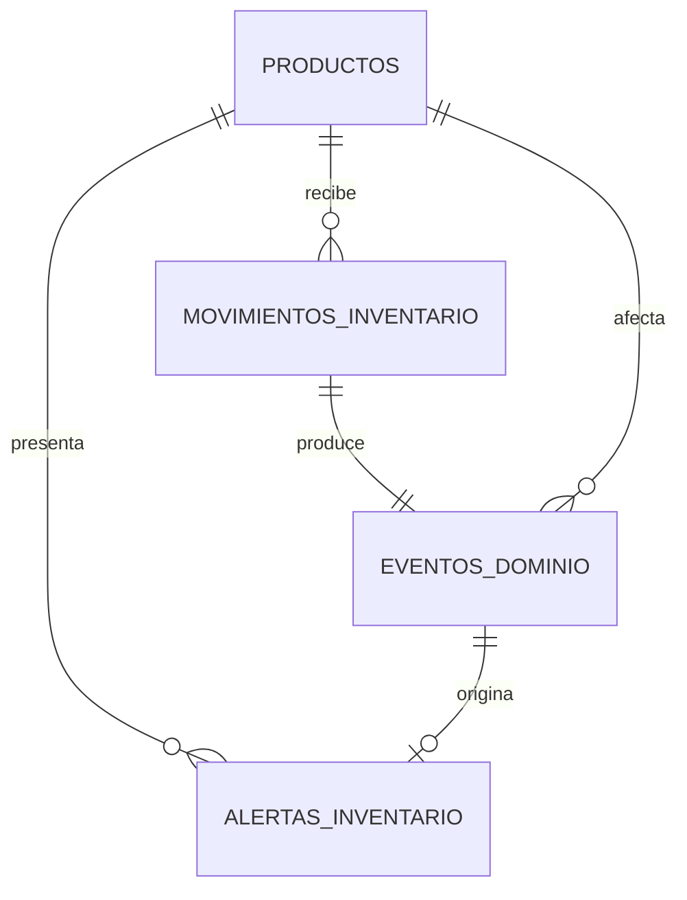

# DA-001: Modelo de datos del inventario

> **Tipo:** Data  
> **Feature:** F-1.1, F-1.3, F-2.1, F-2.2, F-2.3, F-3.1, F-3.2, F-3.3  
> **ACs definidos por esta Spec:** Criterios relacionados con persistencia, relaciones, trazabilidad e integridad de estas features  
> **Status:** draft

## Tabla

Esta Spec propone el modelo de datos necesario para controlar productos, movimientos, eventos y alertas en un solo almacén. El schema todavía no existe en Convex; el contenido siguiente define el contrato que deberá implementarse y validarse.

| Tabla propuesta | Propósito |
|---|---|
| `productos` | Mantener la información del producto y su existencia actual proyectada. |
| `movimientosInventario` | Conservar el historial inmutable de entradas y salidas. |
| `eventosDominio` | Registrar el hecho `MovimientoInventarioRegistrado` que procesará el consumidor. |
| `alertasInventario` | Conservar alertas activas y resueltas de stock bajo. |

No se propone una tabla de almacenes porque la primera versión operará con un solo almacén. La extensión a múltiples ubicaciones requerirá una nueva versión de esta Spec.

## Schema

El siguiente schema es una propuesta previa a la implementación. Los nombres deberán conservarse salvo que durante la revisión se identifique una incompatibilidad técnica.

```typescript
import { defineSchema, defineTable } from "convex/server";
import { v } from "convex/values";

export default defineSchema({
  productos: defineTable({
    sku: v.string(),
    nombre: v.string(),
    descripcion: v.optional(v.string()),
    existenciaActual: v.number(),
    stockMinimo: v.number(),
    activo: v.boolean(),
    creadoEn: v.number(),
    actualizadoEn: v.number(),
  })
    .index("por_sku", ["sku"])
    .index("por_activo", ["activo"]),

  movimientosInventario: defineTable({
    productoId: v.id("productos"),
    tipo: v.union(v.literal("entrada"), v.literal("salida")),
    cantidad: v.number(),
    existenciaAnterior: v.number(),
    existenciaResultante: v.number(),
    motivo: v.string(),
    claveIdempotencia: v.string(),
    creadoEn: v.number(),
  })
    .index("por_producto_creado_en", ["productoId", "creadoEn"])
    .index("por_clave_idempotencia", ["claveIdempotencia"])
    .index("por_creado_en", ["creadoEn"]),

  eventosDominio: defineTable({
    tipo: v.literal("MovimientoInventarioRegistrado"),
    movimientoId: v.id("movimientosInventario"),
    productoId: v.id("productos"),
    existenciaAnterior: v.number(),
    existenciaResultante: v.number(),
    stockMinimo: v.number(),
    estado: v.union(v.literal("pendiente"), v.literal("procesado")),
    creadoEn: v.number(),
    procesadoEn: v.optional(v.number()),
  })
    .index("por_movimiento", ["movimientoId"])
    .index("por_estado_creado_en", ["estado", "creadoEn"])
    .index("por_producto_creado_en", ["productoId", "creadoEn"]),

  alertasInventario: defineTable({
    productoId: v.id("productos"),
    eventoOrigenId: v.id("eventosDominio"),
    tipo: v.literal("stock_bajo"),
    estado: v.union(v.literal("activa"), v.literal("resuelta")),
    existenciaAlGenerarse: v.number(),
    stockMinimo: v.number(),
    creadoEn: v.number(),
    resueltoEn: v.optional(v.number()),
    formaResolucion: v.optional(
      v.union(v.literal("automatica"), v.literal("manual")),
    ),
  })
    .index("por_producto_estado", ["productoId", "estado"])
    .index("por_estado_creado_en", ["estado", "creadoEn"])
    .index("por_evento_origen", ["eventoOrigenId"]),
});
```

## Campos

### `productos`

| Campo | Tipo | Requerido | Descripción |
|---|---|---:|---|
| `sku` | `string` | Sí | Código único utilizado para identificar el producto. |
| `nombre` | `string` | Sí | Nombre visible del producto. |
| `descripcion` | `string` | No | Información adicional. |
| `existenciaActual` | `number` | Sí | Proyección actual; comienza en cero y solo cambia mediante movimientos. |
| `stockMinimo` | `number` | Sí | Umbral a partir del cual el producto se considera con stock bajo. |
| `activo` | `boolean` | Sí | Determina si el producto acepta movimientos nuevos. |
| `creadoEn` | `number` | Sí | Fecha de creación en milisegundos Unix. |
| `actualizadoEn` | `number` | Sí | Fecha de la última actualización. |

### `movimientosInventario`

| Campo | Tipo | Requerido | Descripción |
|---|---|---:|---|
| `productoId` | `Id<"productos">` | Sí | Producto afectado. |
| `tipo` | `entrada \| salida` | Sí | Dirección del cambio de existencia. |
| `cantidad` | `number` | Sí | Unidades enteras positivas. |
| `existenciaAnterior` | `number` | Sí | Existencia antes del movimiento. |
| `existenciaResultante` | `number` | Sí | Existencia después del movimiento. |
| `motivo` | `string` | Sí | Explicación breve de la operación. |
| `claveIdempotencia` | `string` | Sí | Identificador del intento lógico para evitar duplicados. |
| `creadoEn` | `number` | Sí | Fecha en que se registró el movimiento. |

### `eventosDominio`

| Campo | Tipo | Requerido | Descripción |
|---|---|---:|---|
| `tipo` | `MovimientoInventarioRegistrado` | Sí | Tipo único de evento de la primera versión. |
| `movimientoId` | `Id<"movimientosInventario">` | Sí | Movimiento que originó el evento. |
| `productoId` | `Id<"productos">` | Sí | Producto que deberá evaluar el consumidor. |
| `existenciaAnterior` | `number` | Sí | Valor previo guardado para trazabilidad. |
| `existenciaResultante` | `number` | Sí | Valor utilizado para evaluar el umbral. |
| `stockMinimo` | `number` | Sí | Umbral vigente cuando ocurrió el movimiento. |
| `estado` | `pendiente \| procesado` | Sí | Estado del procesamiento del evento. |
| `creadoEn` | `number` | Sí | Fecha de producción del evento. |
| `procesadoEn` | `number` | No | Fecha en que terminó correctamente el consumidor. |

Los fallos de una scheduled mutation se consultarán en `_scheduled_functions` y en los logs de Convex. Esta versión no duplicará ese estado técnico en un campo `fallido` hasta definir un mecanismo propio de recuperación.

### `alertasInventario`

| Campo | Tipo | Requerido | Descripción |
|---|---|---:|---|
| `productoId` | `Id<"productos">` | Sí | Producto con stock bajo. |
| `eventoOrigenId` | `Id<"eventosDominio">` | Sí | Evento que originó el episodio de alerta. |
| `tipo` | `stock_bajo` | Sí | Tipo único de alerta inicial. |
| `estado` | `activa \| resuelta` | Sí | Situación actual de la alerta. |
| `existenciaAlGenerarse` | `number` | Sí | Existencia que produjo la alerta. |
| `stockMinimo` | `number` | Sí | Umbral usado al generarla. |
| `creadoEn` | `number` | Sí | Fecha de creación. |
| `resueltoEn` | `number` | No | Fecha de resolución. |
| `formaResolucion` | `automatica \| manual` | No | Forma en que fue resuelta. |

## Índices

| Nombre | Tabla y campos | Uso |
|---|---|---|
| `por_sku` | `productos.sku` | Comprobar que el SKU no se repita. |
| `por_activo` | `productos.activo` | Listar productos disponibles para movimientos. |
| `por_producto_creado_en` | `movimientosInventario.productoId, creadoEn` | Consultar el historial de un producto ordenado por fecha. |
| `por_clave_idempotencia` | `movimientosInventario.claveIdempotencia` | Detectar un movimiento reenviado. |
| `por_creado_en` | `movimientosInventario.creadoEn` | Consultar movimientos recientes. |
| `por_movimiento` | `eventosDominio.movimientoId` | Comprobar que cada movimiento tenga un solo evento. |
| `por_estado_creado_en` | `eventosDominio.estado, creadoEn` | Consultar eventos pendientes o procesados. |
| `por_producto_creado_en` | `eventosDominio.productoId, creadoEn` | Revisar eventos de un producto. |
| `por_producto_estado` | `alertasInventario.productoId, estado` | Buscar la alerta activa de un producto. |
| `por_estado_creado_en` | `alertasInventario.estado, creadoEn` | Listar alertas activas o resueltas por fecha. |
| `por_evento_origen` | `alertasInventario.eventoOrigenId` | Evitar que un evento cree dos alertas. |

## Relaciones



- Un producto puede tener muchos movimientos.
- Cada movimiento debe producir exactamente un evento.
- Un producto puede acumular varias alertas históricas, pero solo una podrá estar activa.
- Un evento puede no generar alerta, crear una nueva o resolver una alerta existente.

## Reglas de integridad

1. `sku` no puede estar vacío ni repetirse.
2. `nombre` no puede estar vacío.
3. `stockMinimo` debe ser un entero mayor o igual a cero.
4. Todo producto se crea con `existenciaActual: 0`.
5. `existenciaActual` solo cambia dentro de la mutation que registra un movimiento.
6. La cantidad de un movimiento debe ser un entero mayor que cero.
7. Una salida no puede producir una existencia negativa.
8. `existenciaResultante` debe coincidir con la operación aplicada sobre `existenciaAnterior`.
9. Una `claveIdempotencia` corresponde a un solo movimiento.
10. Los movimientos no se editan ni eliminan.
11. Cada `movimientoId` corresponde a un solo evento.
12. Un evento procesado no vuelve al estado pendiente.
13. Solo existe una alerta activa por producto.
14. Una alerta resuelta conserva su información histórica.
15. `formaResolucion` y `resueltoEn` solo se establecen cuando el estado es `resuelta`.
16. Desactivar un producto no elimina movimientos, eventos o alertas relacionados.

Los índices facilitan las comprobaciones, pero las reglas de unicidad deberán validarse dentro de las mutations correspondientes.

## Tests asociados

Los siguientes tests deberán escribirse durante la implementación; todavía no existen.

| Test ID | Título | Tipo |
|---|---|---|
| TC-DA-001-01 | Un producto nuevo se guarda con existencia cero | Integración |
| TC-DA-001-02 | No se aceptan dos productos con el mismo SKU | Integración |
| TC-DA-001-03 | Una clave de idempotencia no produce dos movimientos | Integración |
| TC-DA-001-04 | Un movimiento produce un solo evento | Integración |
| TC-DA-001-05 | Solo existe una alerta activa por producto | Integración |
| TC-DA-001-06 | Desactivar un producto conserva sus relaciones | Integración |
