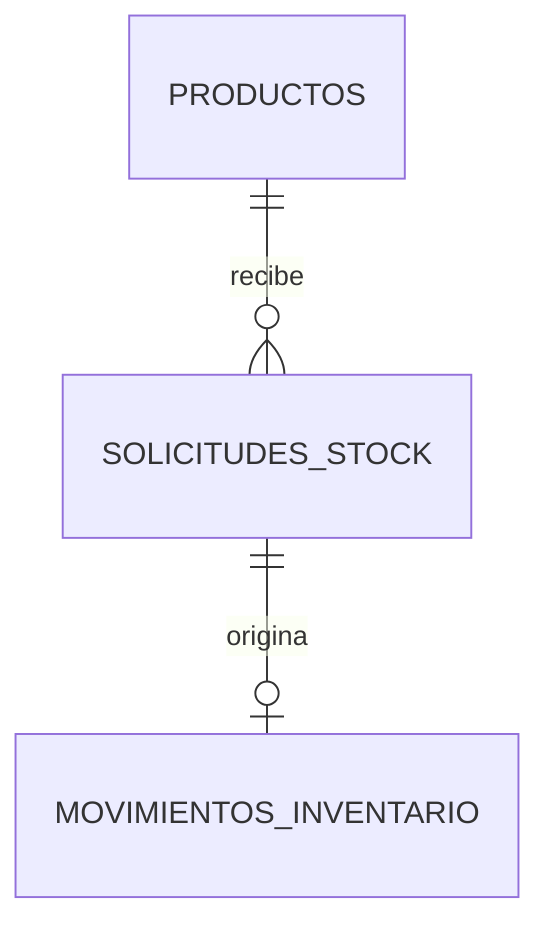
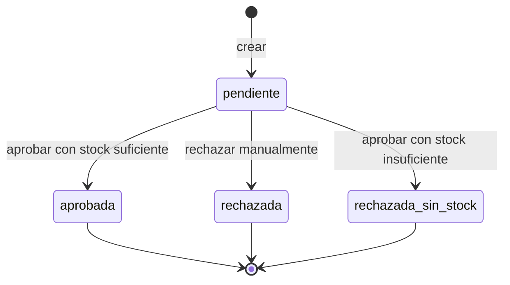

# DA-002: Modelo de solicitudes de stock

> **Tipo:** Data
> **Feature:** F-5.1, F-5.2, F-5.3
> **ACs cubiertos:** F-5.1 AC1-AC9; F-5.2 AC1, AC5; F-5.3 AC2-AC7
> **Status:** draft
> **Dependencias:** DA-001
> **Architecture ref:** ARCH-inventario, AD-8

## Tabla

Esta Spec define la tabla `solicitudesStock` y su relación con `productos` y `movimientosInventario`. No modifica ninguna tabla existente.

| Tabla | Propósito |
|---|---|
| `solicitudesStock` | Registrar peticiones de salida pendientes de aprobación explícita. |

### Estado por fase

| Tabla | Estado | Fase |
|---|---|---|
| `solicitudesStock` | Propuesta | Fase 5 |

## Schema

```typescript
solicitudesStock: defineTable({
  productoId: v.id("productos"),
  cantidadSolicitada: v.number(),
  motivo: v.string(),
  solicitante: v.optional(v.string()),
  estado: v.union(
    v.literal("pendiente"),
    v.literal("aprobada"),
    v.literal("rechazada"),
    v.literal("rechazada_sin_stock"),
  ),
  claveIdempotencia: v.string(),
  origen: v.union(v.literal("interfaz"), v.literal("api")),
  existenciaAlSolicitar: v.number(),
  disponibleAlSolicitar: v.boolean(),
  existenciaDisponibleAlResolver: v.optional(v.number()),
  motivoRechazo: v.optional(v.string()),
  movimientoId: v.optional(v.id("movimientosInventario")),
  creadaEn: v.number(),
  actualizadaEn: v.number(),
  resueltaEn: v.optional(v.number()),
})
  .index("por_clave_idempotencia", ["claveIdempotencia"])
  .index("por_estado_creada_en", ["estado", "creadaEn"])
  .index("por_producto_creada_en", ["productoId", "creadaEn"]),
```

## Campos

### `solicitudesStock`

| Campo | Tipo | Requerido | Descripción |
|---|---|---:|---|
| `productoId` | `Id<"productos">` | Sí | Producto al que se solicita la salida. |
| `cantidadSolicitada` | `number` | Sí | Unidades enteras positivas solicitadas. |
| `motivo` | `string` | Sí | Justificación de la solicitud. No puede estar vacío. |
| `solicitante` | `string` | No | Identificador libre del solicitante; su ausencia no impide crear la solicitud. |
| `estado` | `pendiente \| aprobada \| rechazada \| rechazada_sin_stock` | Sí | Estado actual de la solicitud. Comienza siempre como `pendiente`. |
| `claveIdempotencia` | `string` | Sí | Identificador único del intento lógico para evitar duplicados. |
| `origen` | `interfaz \| api` | Sí | Canal desde el que se creó la solicitud. |
| `existenciaAlSolicitar` | `number` | Sí | Existencia en el momento de crear la solicitud. Solo es informativa; no reserva stock. |
| `disponibleAlSolicitar` | `boolean` | Sí | Indica si existía stock suficiente al momento de crear. Solo es informativo. |
| `existenciaDisponibleAlResolver` | `number` | No | Existencia verificada en el momento de la aprobación o rechazo por stock. Solo se registra al resolver. |
| `motivoRechazo` | `string` | No | Razón textual del rechazo. Se establece al rechazar manualmente o al rechazar por stock insuficiente. |
| `movimientoId` | `Id<"movimientosInventario">` | No | Referencia al movimiento de salida creado si la solicitud fue aprobada. |
| `creadaEn` | `number` | Sí | Fecha de creación en milisegundos Unix. |
| `actualizadaEn` | `number` | Sí | Fecha de la última actualización. |
| `resueltaEn` | `number` | No | Fecha en que la solicitud dejó de estar pendiente. |

### Campos según estado

| Campo | `pendiente` | `aprobada` | `rechazada` | `rechazada_sin_stock` |
|---|---|---|---|---|
| `existenciaDisponibleAlResolver` | Ausente | Presente | Ausente | Presente |
| `motivoRechazo` | Ausente | Ausente | Presente | Ausente (el mensaje se genera dinámicamente) |
| `movimientoId` | Ausente | Presente | Ausente | Ausente |
| `resueltaEn` | Ausente | Presente | Presente | Presente |

## Índices

| Nombre | Tabla y campos | Uso |
|---|---|---|
| `por_clave_idempotencia` | `solicitudesStock.claveIdempotencia` | Detectar una solicitud enviada más de una vez con la misma clave. |
| `por_estado_creada_en` | `solicitudesStock.estado, creadaEn` | Listar solicitudes por estado ordenadas por fecha. |
| `por_producto_creada_en` | `solicitudesStock.productoId, creadaEn` | Consultar solicitudes de un producto ordenadas por fecha. |

## Relaciones



- Un producto puede tener muchas solicitudes de stock.
- Una solicitud aprobada origina exactamente un movimiento de salida.
- Una solicitud en cualquier otro estado no origina ningún movimiento.

## Estados y transiciones válidas



| Transición | Condición | Efecto |
|---|---|---|
| `pendiente → aprobada` | Existencia suficiente al momento de aprobar | Se crea un movimiento de salida; `movimientoId` se registra. |
| `pendiente → rechazada_sin_stock` | Existencia insuficiente al momento de aprobar | No se crea movimiento. Se registra `existenciaDisponibleAlResolver`. |
| `pendiente → rechazada` | Rechazo manual explícito | No se crea movimiento. Se registra `motivoRechazo`. |
| Cualquier estado resuelto | Intento de procesar de nuevo | La operación se rechaza; la solicitud no cambia. |

## Reglas de integridad

1. `cantidadSolicitada` debe ser un entero mayor que cero.
2. `motivo` no puede estar vacío.
3. `claveIdempotencia` identifica un solo intento lógico; no puede asociarse a dos solicitudes distintas.
4. Una solicitud se crea siempre con estado `pendiente`.
5. `existenciaAlSolicitar` y `disponibleAlSolicitar` son informativos; nunca modifican `existenciaActual` de `productos`.
6. Solo la transición a `aprobada` puede establecer `movimientoId`.
7. `resueltaEn` se establece únicamente cuando la solicitud sale de `pendiente`.
8. Una solicitud en estado resuelto (`aprobada`, `rechazada`, `rechazada_sin_stock`) no puede volver a `pendiente` ni transicionar a otro estado.
9. No existe eliminación física de solicitudes; son registros históricos permanentes.

## Migración

Esta tabla se añadirá en la fase 5 sin modificar las tablas existentes. No requiere backfill porque parte de un estado vacío. Cualquier cambio incompatible en campos o índices requerirá una nueva versión de esta Spec.

## Definition of Done

- [ ] La tabla `solicitudesStock` se crea con todos los campos y validadores definidos en esta Spec.
- [ ] Los índices `por_clave_idempotencia`, `por_estado_creada_en` y `por_producto_creada_en` existen en el schema.
- [ ] Las reglas de integridad se validan en las funciones de Convex correspondientes.
- [ ] Las transiciones inválidas son rechazadas por las mutations.
- [ ] La Spec fue revisada y aprobada por el responsable humano.

## Verificaciones asociadas

| Test ID | Título | Tipo |
|---|---|---|
| TC-DA-002-01 | Una solicitud nueva se guarda con estado pendiente | Integración |
| TC-DA-002-02 | La misma clave no produce dos solicitudes | Integración |
| TC-DA-002-03 | Aprobar con stock suficiente establece movimientoId y resueltaEn | Integración |
| TC-DA-002-04 | Aprobar sin stock establece rechazada_sin_stock sin movimientoId | Integración |
| TC-DA-002-05 | Una solicitud resuelta no cambia de estado | Integración |

## Changelog

- v1.0 (2026-08-06): Borrador inicial del modelo de solicitudes de stock (actividad #61).
