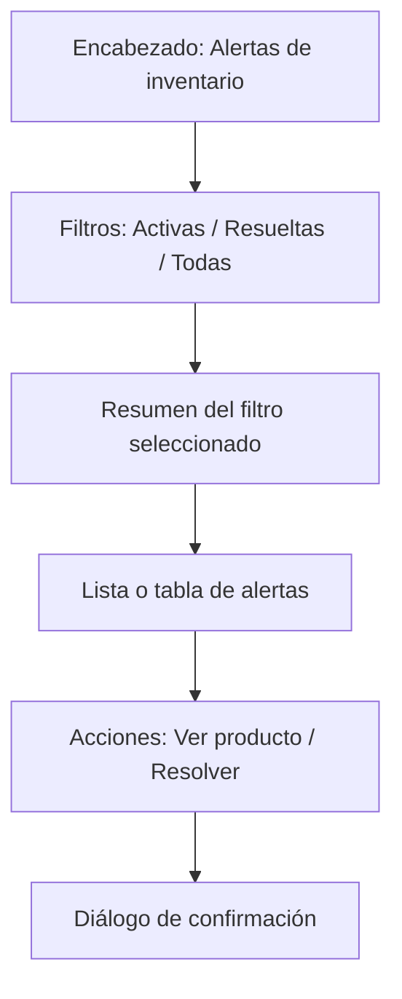

# FE-003: Interfaz de alertas

> **Tipo:** Frontend  
> **Feature:** F-3.2, F-3.3  
> **ACs definidos por esta Spec:** F-3.2 AC1-AC5; F-3.3 AC2-AC6  
> **Status:** draft  
> **Dependencias:** DA-001, BE-003, BE-004

## Qué muestra

La interfaz permitirá al administrador consultar alertas activas y resueltas, identificar el producto relacionado y resolver manualmente una alerta activa. También distinguirá el estado administrativo de la alerta de la condición real del producto: resolver una alerta no ocultará el indicador de stock bajo cuando la existencia continúe en o por debajo del mínimo.

Los nombres de archivos y componentes son propuestas previas a la implementación. Esta Spec define responsabilidades y estados para evitar que la interfaz se improvise durante el desarrollo.

## Rutas

| Ruta | Componente | Descripción |
|---|---|---|
| `/alertas` | `PaginaAlertas` | Mostrar alertas activas y resueltas, filtros y acciones. |
| `/productos/[productoId]` | `PaginaDetalleProducto` | Destino al seleccionar el producto relacionado con una alerta. Se define completamente en `FE-001`. |

## Componentes

```text
src/componentes/alertas/
  lista-alertas.tsx              → Seleccionar la representación de tabla o tarjetas.
  tabla-alertas.tsx              → Mostrar alertas en escritorio.
  tarjeta-alerta.tsx             → Mostrar una alerta en pantallas pequeñas.
  filtros-alertas.tsx            → Cambiar entre activas, resueltas y todas.
  estado-alerta.tsx              → Mostrar badge activa o resuelta.
  dialogo-resolver-alerta.tsx    → Confirmar la resolución manual.
  estado-vacio-alertas.tsx       → Informar cuando no existan resultados.
  esqueleto-alertas.tsx          → Representar la carga inicial.
```

| Componente | Entradas propuestas | Responsabilidad |
|---|---|---|
| `ListaAlertas` | `alertas`, `estado`, `alSeleccionar` | Elegir tabla o tarjetas y presentar la colección. |
| `TablaAlertas` | `alertas` | Mostrar producto, existencia, mínimo, estado y fechas en escritorio. |
| `TarjetaAlerta` | `alerta` | Mostrar la misma información en formato vertical para móvil. |
| `FiltrosAlertas` | `estadoActual`, `alCambiar` | Seleccionar `activas`, `resueltas` o `todas`. |
| `EstadoAlerta` | `estado` | Mostrar un badge consistente. |
| `DialogoResolverAlerta` | `alerta`, `abierto`, `alConfirmar` | Advertir que resolver no modifica la existencia. |
| `EstadoVacioAlertas` | `filtro` | Explicar que no hay alertas para el estado seleccionado. |
| `EsqueletoAlertas` | Ninguna | Mantener la estructura mientras carga la query. |

La interfaz consumirá de forma propuesta:

- `api.alertasInventario.listar` definida en `BE-004`.
- `api.alertasInventario.resolverManual` definida en `BE-003`.

## Wireframe



### Información de cada alerta

| Elemento | Contenido |
|---|---|
| Producto | Nombre y SKU. |
| Existencia | Cantidad detectada al generar la alerta. |
| Stock mínimo | Umbral utilizado. |
| Estado | `Activa` o `Resuelta`. |
| Creación | Fecha y hora de generación. |
| Resolución | Forma y fecha cuando esté resuelta. |
| Estado actual del producto | Indicador de stock bajo calculado con la existencia actual. |

## Comportamiento

### Carga

- Mientras `useQuery` devuelve `undefined`, se mostrará `EsqueletoAlertas`.
- Los filtros estarán visibles, pero no iniciarán otra acción mientras se carga la primera consulta.
- No se mostrará temporalmente el mensaje de lista vacía durante la carga.

### Estado vacío

- Si no hay alertas activas, el mensaje será: “No hay alertas activas”.
- Si no hay alertas resueltas, el mensaje será: “No hay alertas resueltas”.
- El estado vacío no se tratará como error.

### Estado con resultados

- Las alertas aparecerán de la más reciente a la más antigua.
- El filtro inicial será `activas`.
- Cambiar el filtro no recargará la página completa.
- Seleccionar el producto navegará a `/productos/[productoId]`.
- Una alerta resuelta no mostrará la acción `Resolver`.

### Resolución manual

1. El administrador selecciona `Resolver` en una alerta activa.
2. Se abre `DialogoResolverAlerta`.
3. El diálogo informa: “Resolver esta alerta no modifica la existencia del producto”.
4. Confirmar ejecuta `alertasInventario.resolverManual`.
5. Mientras la mutation está pendiente, el botón queda deshabilitado.
6. Si termina correctamente, se cierra el diálogo y se muestra una confirmación.
7. La query reactiva mueve la alerta a resueltas.
8. Si el producto sigue bajo, conserva su indicador de stock bajo.

### Error

- Si la query falla, se mostrará un mensaje de error con una acción para volver a intentar.
- Si la mutation falla, el diálogo permanecerá abierto y permitirá reintentar.
- Un error no cambiará visualmente la alerta a resuelta antes de recibir confirmación.
- No se mostrarán stack traces ni mensajes internos de Convex.

### Alertas resueltas automáticamente

- Mostrarán `formaResolucion: Automática`.
- No ofrecerán acción manual.
- Permanecerán disponibles en el filtro `Resueltas` y `Todas`.

## Responsive

| Tamaño | Comportamiento |
|---|---|
| Escritorio (`>= 768px`) | Se utiliza `TablaAlertas`; filtros y resumen aparecen en una fila superior. |
| Móvil (`< 768px`) | Se utiliza una lista de `TarjetaAlerta`; cada tarjeta apila producto, cantidades, estado y acciones. |

- Ningún contenido deberá provocar desplazamiento horizontal en móvil.
- Las acciones táctiles tendrán un área mínima cómoda para seleccionar.
- El diálogo ocupará el ancho disponible con márgenes laterales.
- La información principal se mantendrá visible sin depender únicamente del color.

## Paquetes (si aplica)

No se propone instalar paquetes adicionales. Se utilizarán los componentes disponibles de Shadcn/ui y las dependencias ya definidas por la arquitectura:

- `Tabs` o `ToggleGroup` para filtros.
- `Table` para escritorio.
- `Card` para móvil.
- `Badge` para estados.
- `AlertDialog` para confirmar resolución.
- `Skeleton` para carga.
- `Button` para acciones.
- `Sonner` para mensajes de éxito o error, si ya forma parte de la configuración del proyecto.

## Tests asociados

Los siguientes tests describen verificaciones futuras; todavía no están implementados.

| Test ID | Título | Tipo |
|---|---|---|
| TC-FE-003-01 | Muestra alertas activas y resueltas en su filtro | Componente |
| TC-FE-003-02 | Muestra estado vacío sin confundirlo con carga | Componente |
| TC-FE-003-03 | Navega al detalle del producto relacionado | Componente |
| TC-FE-003-04 | Abre confirmación antes de resolver manualmente | Componente |
| TC-FE-003-05 | Deshabilita la acción mientras se resuelve | Componente |
| TC-FE-003-06 | Conserva el diálogo y muestra error si falla la mutation | Componente |
| TC-FE-003-07 | Una alerta resuelta no muestra la acción Resolver | Componente |
| TC-FE-003-08 | En móvil utiliza tarjetas sin desbordamiento horizontal | Manual |
